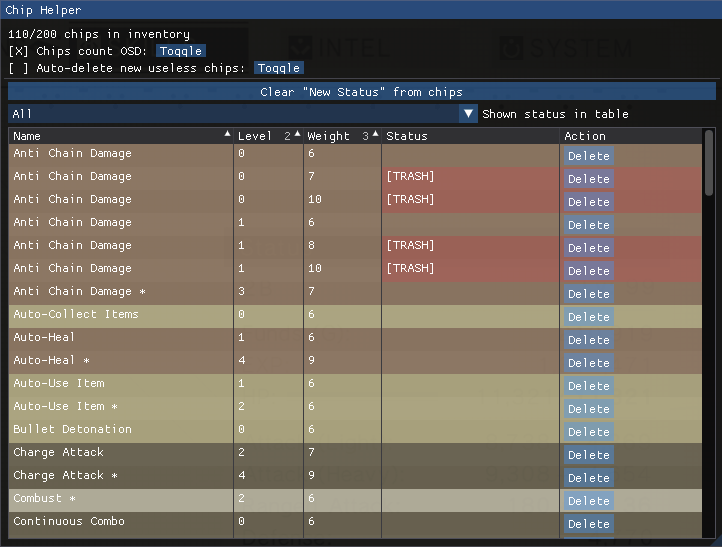

# NieRChipHelper

> NieRAutomata mod to improve chips use

- [NieRChipHelper](#nierchiphelper)
  - [Important Notes](#important-notes)
  - [How to use](#how-to-use)
  - [Features](#features)
  - [How to build](#how-to-build)
  - [TODO](#todo)
  - [Credits](#credits)

## Important Notes

This mod was developed for the Steam version of the game, with the 15/07/2021 update.

Support for [FAR](https://github.com/Kaldaien/FAR) has not been tested.

This mod it's intended to be used during gameplay to better browse chips, find the new ones among the list, and delete the useless one. It doesn't help to spawn chips, fuse them outside the shops, or perform other game-breaking actions.

## How to use

Download the latest version from the **Releases** section.

This mod is in the form of a dynamic library -> `.dll`. To use it, you can either use the bundled loader, or an injector of yours.

All the Keybind and Features will be active once the game world is fully loaded.

| Keybind | Action                   |
|---------|--------------------------|
| F2      | Open the main window     |
| F3      | Gracefully eject the mod |

## Features

- Browse chips more easily.
- Delete chips you don't want from the same place. No confirmations will be asked.
- Based on [this awesome guide][quick-reference-guide], chips will be marked with the "Trash" status if they are not worth keeping.
- Chips picked up, bought, or resulting from a fusion; will be marked as "New" to distinguish them.
- **Auto-Delete useless chips**: When this feature is active, if a picked or bought chip is not worth keeping based on the guide above, it won't be picked up.
- **OSD**: When active, shows the chips count in the top left part of the screen.

## How to build

To build the `.dll` library follow the following steps:

1. Build your own copy of the [Microsoft Detours][detours] library. Copy `lib.X64\detours.lib` and `include\detours.h` in the `NieRChipHelper` folder. (Project tested with Detours Version 4.0.1)
2. Open the `NieRChipHelper.sln` solution and build it.

If you also want to build the loader:

1. Open the `NieRChipHelperLoader.sln` solution and build it.

## TODO

- [ ] Support controller navigation
- [ ] When deleting equipped chips, the effect of the deleted chips remains until the ESC menu is opened.

## Credits

Thanks to the following libraries and guides that are being used in this project:

- [Dear ImGui][dear-imgui]
- [Microsoft Detours][detours]
- [NieR: Automata Plug-in Chip Quick Reference Guide][quick-reference-guide]

[dear-imgui]: https://github.com/ocornut/imgui
[detours]: https://github.com/Microsoft/Detours
[quick-reference-guide]: https://docs.google.com/spreadsheets/d/1fNMz4foJEWZpbbZH3GcdwucftESNYNffEOobdCyRO4E/pubhtml#
